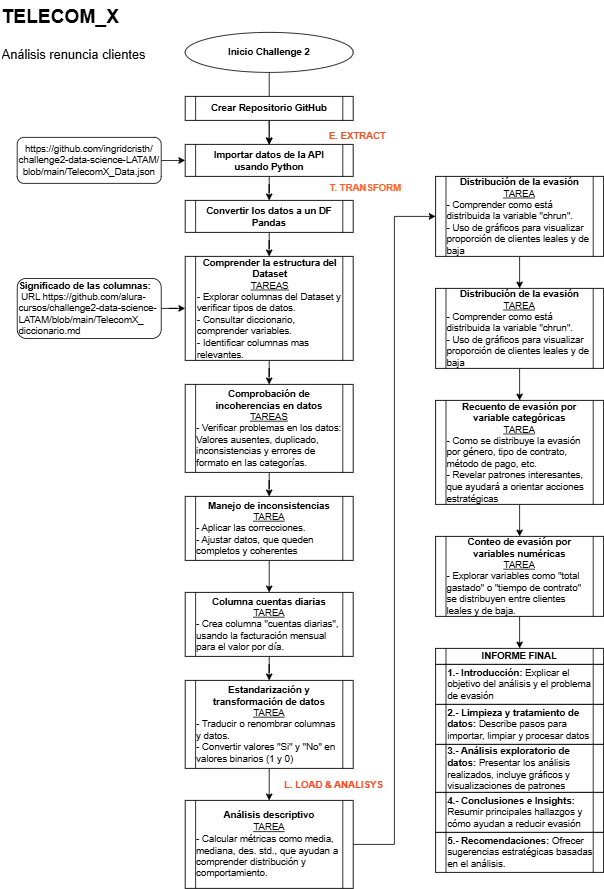

<h1>Challenge Telecom_X_LATAM: Evasión de Clientes</h1>

<h1>Etado del proyecto: En etapa inicial</h1>

<h1>Archivos bajados</h1>

# Exploración Analítica de Churn en Clientes de Servicios

Este repositorio contiene el análisis exploratorio completo de cancelaciones de clientes en una empresa de servicios por suscripción. Se han aplicado técnicas de estadística descriptiva, visualización de datos y correlaciones para identificar patrones y generar recomendaciones prácticas orientadas a la retención.

---

## Objetivos del Proyecto 

- Analizar el comportamiento histórico de cancelaciones (`churn`) en clientes.
- Detectar variables con alto impacto en la permanencia y valor económico.
- Identificar valores atípicos, distribuciones sesgadas y relaciones ocultas.
- Generar recomendaciones estratégicas para mejorar la retención y minimizar pérdidas.

---
## Contenido del Repositorio

#### Repositorio original 
"https://raw.githubusercontent.com/alura-cursos/challenge2-data-science-LATAM/refs/heads/main/TelecomX_Data.json"

---
## Estructura del Análisis

1. **Estadística Descriptiva**  
   Evaluación de tendencias centrales, dispersión y asimetría de las principales variables numéricas (`Monto_Mensual`, `Monto_Total`, `Meses_Contrato`).

2. **Distribución de Variables Categóricas**  
   Análisis de atributos como tipo de contrato, servicios adicionales y características demográficas.

3. **Detección de Valores Atípicos**  
   Identificación y visualización de clientes extremos en términos de pagos o duración.

4. **Análisis del Churn**  
   Estudio de la distribución de cancelaciones y su concentración en períodos específicos.

5. **Correlación de Variables**  
   Matriz de correlaciones para evaluar vínculos estadísticos entre variables financieras y la probabilidad de cancelación.

---

## Conclusión Integral del Análisis Exploratorio del Churn de Clientes

Este estudio proporciona una visión estructurada del comportamiento de los clientes y los factores relacionados con la cancelación del servicio. Se han abordado diversas capas analíticas que permiten comprender tanto tendencias generales como indicios específicos para la toma de decisiones estratégicas.

1. Estadística Descriptiva General: 
El dataset revela una base de clientes con alta dispersión en términos de permanencia (Meses_Contrato), pagos mensuales (Monto_Mensual) y total acumulado (Monto_Total).
- Se observan asimetrías positivas en variables financieras, con valores concentrados en rangos bajos y algunos clientes con contribuciones económicas muy elevadas.
- Las medidas de tendencia central y dispersión reflejan una alta heterogeneidad de comportamiento financiero, lo que sugiere diferentes perfiles de usuarios.

2. Distribución de Variables Categóricas: 
El análisis de las variables categóricas indica patrones como:
- La mayoría de los clientes poseen contrato mensual, lo que se asocia a una mayor tasa de cancelación.
- Servicios adicionales como respaldo técnico o cuentas múltiples no están distribuidos de forma homogénea, lo que requiere segmentación para interpretar su impacto.
- Variables como Genero, Senior y ServicioTecnico presentan distribuciones ligeramente balanceadas, pero aún con sesgos que podrían condicionar decisiones de retención.

3. Identificación de Valores Atípicos 
Se detectan valores atípicos principalmente en:
- Monto_Total: Clientes con pagos acumulados significativamente superiores a la media.
- Monto_Mensual: Tarifas mensuales con valores extremos que pueden corresponder a clientes corporativos o errores de captura. Estos outliers pueden distorsionar modelos predictivos si no se gestionan adecuadamente o si no se segmentan en cohortes específicas.

4. Distribución de Cancelaciones 
La variable de cancelación (Cancelación_binaria) muestra:
- Una proporción significativa de clientes cancelados, principalmente concentrados en periodos iniciales del contrato.
- La distribución indica un comportamiento de churn temprano, lo que enfatiza la necesidad de robustecer las estrategias de onboarding.

5. Análisis Correlacional 
Las correlaciones revelan:
- Alta relación entre permanencia y valor acumulado (Meses_Contrato ↔ Monto_Total), confirmando que el tiempo de suscripción explica el aporte económico.
- Correlaciones débiles pero significativas con la cancelación, donde contratos cortos y altos pagos mensuales se relacionan con mayor riesgo de abandono.
- Variables como edad o número de cuentas tienen correlaciones muy débiles, lo que requiere métodos más complejos (segmentación o modelado) para confirmar su relevancia.

**Síntesis Estratégica** 
El análisis sugiere que la duración del contrato es el principal predictor del valor y retención, mientras que los planes de alto costo mensual pueden generar fricción si no se equilibran con una buena experiencia de usuario. Los valores atípicos, aunque informativos, deben tratarse con cautela. La presencia de cancelaciones tempranas apunta a mejorar el onboarding, ofrecer beneficios diferenciales en los primeros meses y revisar la estructura de precios.

---
## INFORME FINAL

### Conclusiones

#### Perfil financiero y estadístico del cliente:  
La base de datos presenta una alta dispersión en métricas como Monto_Mensual, Monto_Total y Meses_Contrato, evidenciando distintos perfiles de consumo y permanencia. Las variables muestran asimetrías que confirman la heterogeneidad del comportamiento. 
#### Distribución de variables categóricas:  
La mayoría de los clientes se encuentran bajo contrato mensual, lo que se asocia a una mayor vulnerabilidad frente a la cancelación. Servicios complementarios, como soporte técnico y cuentas múltiples, presentan distribuciones irregulares que requieren segmentación para análisis profundo. 
#### Valores atípicos: 
Se identifican outliers principalmente en montos pagados, lo que podría reflejar clientes de alta rentabilidad o errores. Estas observaciones extremas deben tratarse cuidadosamente para evitar sesgos en modelos predictivos. 
#### Distribución del churn: 
La cancelación se concentra en los primeros meses del contrato, lo que sugiere debilidad en la experiencia inicial del cliente. La variable de cancelación presenta un patrón de abandono temprano que impacta directamente en la rentabilidad. 
#### Relaciones correlacionales: 
La correlación alta entre Meses_Contrato y Monto_Total revela que la permanencia es el principal determinante del valor económico. 
Las correlaciones negativas entre duración del contrato y cancelación indican que los contratos cortos están fuertemente asociados al abandono.  Planes con tarifas mensuales elevadas muestran una débil relación positiva con el churn, posiblemente por percepción de sobrecosto.

### Recomendaciones

#### - Refuerzo del onboarding y retención temprana:  
Diseñar programas de bienvenida y soporte intensivo en los primeros meses para reducir cancelaciones tempranas. 
#### - Optimización de planes mensuales:  
Evaluar la relación entre precio y valor percibido, especialmente en tarifas altas, ajustando la propuesta de valor para evitar insatisfacción. 
#### - Tratamiento analítico de outliers:  
Filtrar o segmentar clientes con valores extremos para evitar distorsión en análisis predictivos y tomar decisiones comerciales diferenciadas. 
#### - Segmentación para personalización:  
Usar agrupamientos por características demográficas y de consumo para identificar grupos de riesgo específicos y adaptar estrategias. 
#### - Evaluación de contratos como herramienta de fidelización:  
Promover contratos más extensos con beneficios escalonados que incentiven la permanencia y mitiguen el churn. 

## En resúmen: 

- Mejorar el onboarding en los primeros meses, donde se concentra el churn.
- Evaluar el diseño de contratos más extensos con beneficios progresivos.
- Revisar precios mensuales altos que podrían inducir cancelación temprana.
- Tratar valores extremos cuidadosamente para evitar sesgos en modelos posteriores.

---

## Autor

**Mauricio Flores Z**  
Estudiante Alura Latam especialización Data Science.  
Contacto: [mafloreszelaya634@gmail] 

